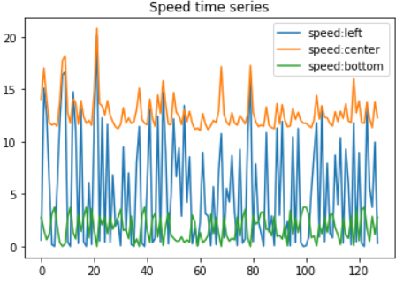
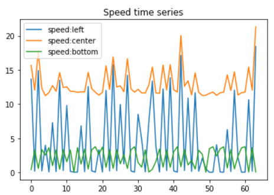
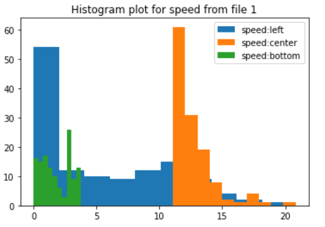
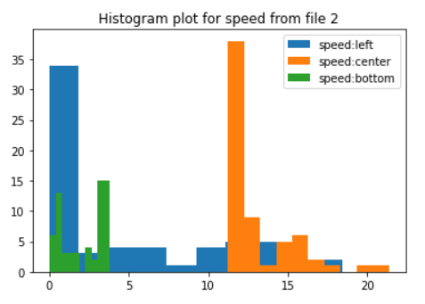
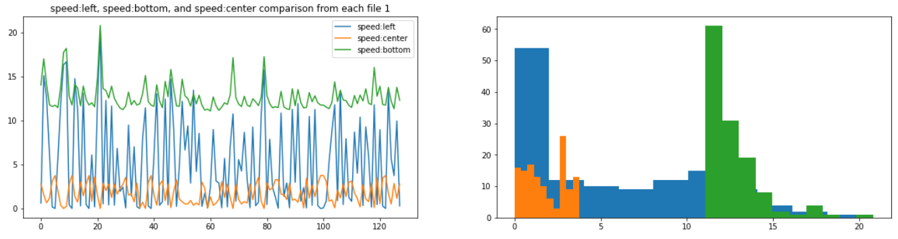

# NREL-internship

## Install

In order to run the code in this repo you'll need to install the following packages.

### Install `git bash`

- Download the latest version of Git Bash from their [official website](https://git-scm.com/).
- Click the *“Download for windows”* button and download Git Bash
- Run the Installer and select destination location (just leave the default option as it is, and click *“Next”*). 
- Adjust your PATH Environment and select *"Use Git from Git Bash only"*.
- Leave the default options as it is, and click *"Next"*.
- Click *"Install"* and complete the Git setup wizard. 
- Check the *“Launch Git Bash”* and click *“Finish”* to launch Git Bash.
- The terminal will open and you will be able to enter commands.

### Clone the repo

- Open the repository that you want to clone. 
- Click on *"Code"* tab and copy the **HTTPS link**. 
- Open GitBash with folder where you want to download it. Type

        git clone

    and paste the **HTTPS link** and hit enter.
- Repository is now downloaded on your computer and you can open it with [Visual Studio code](https://code.visualstudio.com/).

### Download Anaconda

- Download [Anaconda](https://www.anaconda.com/products) from from their official website.
- Double click the installer to launch and hit *"Next"*.
- Read the licensing terms and click *“I Agree”*.
- Select an install for *“Just Me”* and click *"Next"*.
- Select a destination folder to install Anaconda and click the *"Next"* button.
- Click the *"Install"* button. 
- Click the *"Next"* button.
- After a successful installation click the *"Finish"* button.

### Build the conda Environments

- You can create your first conda environment by typing:

         conda env create -f environment.yml

- To activate your environment, type:

        conda activate nrel

- Next step is verify you are using the correct `python` version: 

        which python

- Now you can open jupyter notebook by typing      
        
        jupter notebook

## Running the notebooks

### Download Data

- Here is google drive link from where you can download data file: https://drive.google.com/drive/folders/1YhBtKIuqzM_TvbwBYY6-UMVAD8o-WS10?usp=sharing
- Click on the link and download both folders and files into the notebooks directory.

## Discussion of results

- Here is the link for the [Analysis](notebooks/Analysis.ipynb) notebook: 

### Example graphs from Analysis.ipynb

